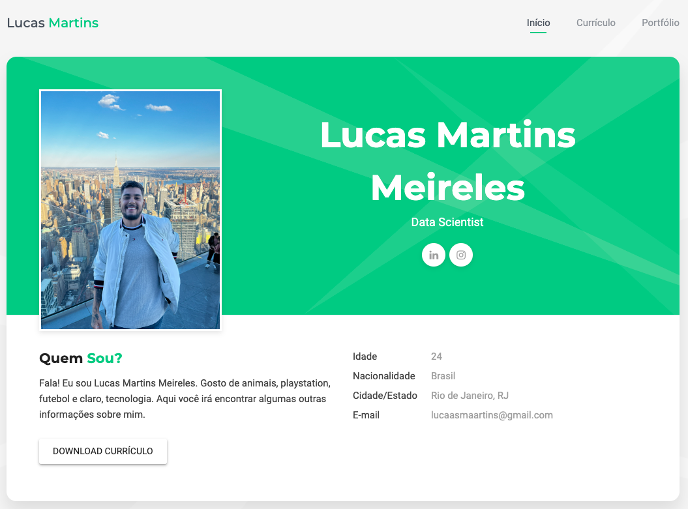

# Currículo Vitae Online
> Repositório criado com o objetivo de estudar Git e adicionalmente, criar um projeto real, cujo objetivo é a construção de um currículo online.

A primeira seção é uma apresentação curta com link para o instagram e linkedin.

A segunda seção apresenta minhas experiencias e educação.

A terceira seção um link para o portfólio no git.

>* Projeto inicial `clonado` de: https://github.com/felicityBR/felicityBR.github.io